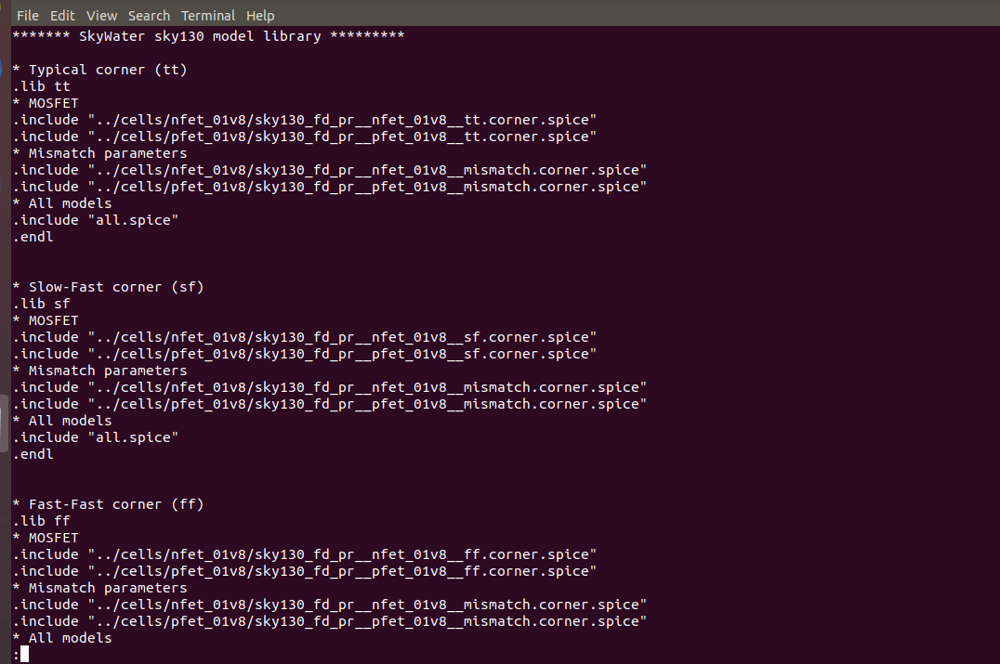

# VSDCMOS_labs
this repository consists of labs done in ngspice 

**File descriptions :**
- sky130.lib.spice file contains all the include commands for including the libraries for nfet and pfet <br>
  
- The design folder in the lab repository contains the two folders : "cells" and "models"
- The "cells" folder contains library files for nfet and pfet. The library files for different corners for a nfet is shown below <br>
 

    - contents of a spice library file for a tt nfet is shown below. It contains different parameters for describing the nfet. <br>
      

- The models folder contains the sky130.lib.spice (explained above).

## Lab 1 - nfet characteristics 

Plotting the graph between Ids and Vds we need to write the following SPICE code: <br>
```bash
  *Model Description
.param temp=27

*Including sky130 library files
.lib "sky130_fd_pr/models/sky130.lib.spice" tt

*Netlist Description

XM1 Vdd n1 0 0 sky130_fd_pr__nfet_01v8 w=0.39 l=0.15
R1 n1 in 55

Vdd vdd 0 1.8V
Vin in 0 1.8V

*simulation commands

.op
.dc Vdd 0 1.8 0.1 Vin 0 1.8 0.2

.control

run
display
setplot dc1
.endc

.end
```
<br>
Commands to launch ngspice and plot graph of Ids vs Vds <br>

 <br><br>

 The snap shot of plot between Ids and Vds:<br> 
 

 <br>

 - To observe any point on the graph, left click on the point
 - The corresponding (x,y) values would be reflected in the terminal
 - The peak current was found out to be 210 micro Ampere.

   
 
 ## Lab 2 - nfet characteristics for lower nodes

 For plotting the graph between Ids and Vds for short channel devices we need to write the following SPICE code:
```bash
*Model Description
.param temp=27

*Including sky130 library files
.lib "sky130_fd_pr/models/sky130.lib.spice" tt

*Netlist Description

XM1 Vdd n1 0 0 sky130_fd_pr__nfet_01v8 w=0.39 l=0.15
R1 n1 in 55

Vdd vdd 0 1.8V
Vin in 0 1.8V

*simulation commands

.op
.dc Vdd 0 1.8 0.1 Vin 0 1.8 0.2

.control

run
display
setplot dc1
.endc

.end
```
<br>

The snap shot of plot between Ids and Vds for lower nodes: <br> 

 <br>

The plot for Id vs Vgs for Vds = 1.8 V at lower nodes is shown below: <br>
 <br>


- this graph is usually quadratic but we see that it becomes linear for lower nodes.
- This linearization of Id vs Vgs curve is due to **velocity saturation** and this is one of the effects under **short channel effect**.
- The threshold voltage is the voltage at which the drain current shoots up exponentially
- Move the cursor along the linear part of the graph and keep moving linearly till you cut the x axis. That will give Vt

### Effect of velocity saturation in Lower nodes vs Higher nodes
 <br>

In velocity saturation the current Id saturates early. As a result peak current for same W/L ratio decreases. 

## Lab 3 - Voltage transfer characteristics of a CMOS

To plot the VTC for a CMOS we need the following code:

```bash
*Model Description
.param temp=27

*Including sky130 library files
.lib "sky130_fd_pr/models/sky130.lib.spice" tt

*Netlist Description

XM1 out in vdd vdd sky130_fd_pr__pfet_01v8 w=0.84 l=0.15
XM2 out in 0 0 sky130_fd_pr__nfet_01v8 w=0.36 l=0.15

Cload out 0 50fF

Vdd vdd 0 1.8V
Vin in 0 1.8V

*simulation commands

.op

.dc Vin 0 1.8 0.01

.control
run
setplot dc1
display
.endc

.end
```


 <br>

 After giving the above commands the VTC of CMOS was found as below
 


### Switching threshold of CMOS

- Switching threshold is a voltage at which the device switches.
- At switching threshold Vin = Vout.
- To calculate the switching threshold of CMOS. We zoomed in the exact middle of the metastability region of the VTC <br>

 <br>
The switching threshold = 0.877 microvolts

### Transient analysis of CMOS <br>

The following code was needed for transient analysis <br> 

 <br>


The snapshot of the graph of transient analysis is found as below <br>


- Rise delay = time lag between 50% of output rise and 50% of input fall.
- From the graph the following points were noted for rise delay <br>

<br>

Rise delay = 2.48 - 2.15 = 0.33ns <br>

- Fall delay = time lag between 50% of output fall and 50% of input rise. <br>

 <br>

Fall delay = 4.33 - 4.04 = 0.29ns <br>

## Lab 4 - Noise margin of CMOS

- Noise margin means the tolerance of a cmos circuit for logic 1 or logic 0 <br>
  
 <br>

The transfer characteristics from which noise margin is calculated is given below: <br>
  <br>

 - The values of Voh , Vih and Vih, Vol were found by left clicking at the points in the VTC where the slope of the graph became -1
 - The values were noted as below
 

 <br>

  Method to calculate noise margin: <br>

 - Noise margin high = Voh - Vih = 1.689 - 0.970 = 0.7184
 - Noise margin low = Vil - Vol = 0.7836 - 0.1253 = 0.658. <br>
   

*Thanks for reading*


